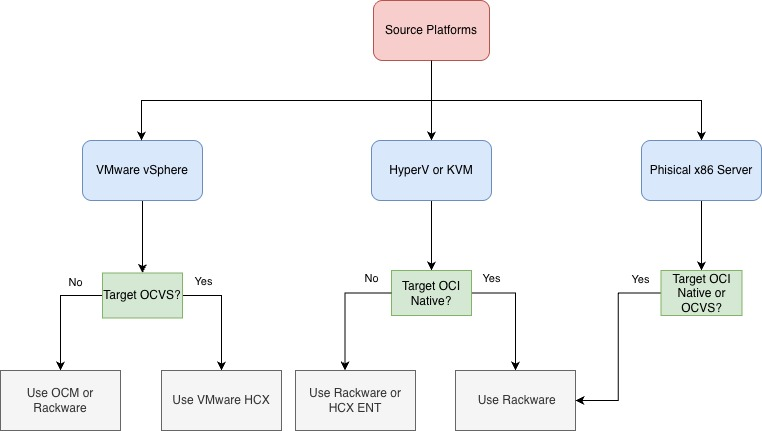
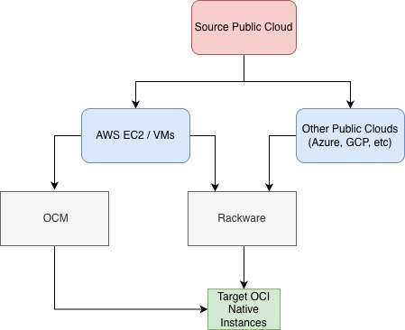
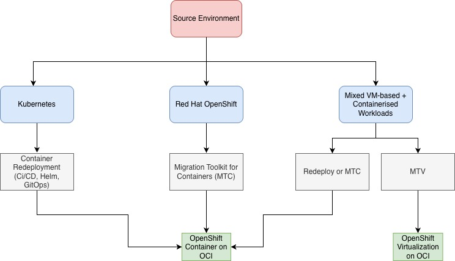

# Workload Migration to OCI - Scenarios & Guidelines

This guide provides a comprehensive technical framework for migrating workloads to Oracle Cloud Infrastructure (OCI). It addresses migrations from virtualized, bare-metal, public cloud, and platform-based environments, outlining lift-and-shift, replatforming, redeployment, and consolidation strategies.

The guide covers VMware and non-VMware virtualization, cross-cloud replatforming, OpenShift-based platform standardization, and mixed VM–container convergence paths. It also details the tooling and architectural patterns required to execute large-scale enterprise migrations with minimal operational disruption.

## Migration Scenarios

This guide outlines the principal migration paths for transitioning workloads from on-premises and public cloud environments to Oracle Cloud Infrastructure (OCI), covering virtualized, bare-metal, cloud-native, and containerized platforms. The following scenarios are considered:

**Virtual Machine & Bare-Metal Workloads**

- VMware vSphere → Oracle Cloud VMware Solution (OCVS): A lift-and-shift migration preserving the full VMware SDDC stack (ESXi, vCenter, vSAN, NSX). This approach minimizes operational disruption and enables Layer-2 extension, IP retention, and live mobility using VMware HCX.

- VMware vSphere → OCI Native Compute Instances: VMware VMs are replatformed onto OCI Compute through VM format conversion and infrastructure adaptation. Tooling such as Oracle Cloud Migrations (OCM) and RackWare supports discovery, replication, and deployment into OCI-native environments.

- Microsoft Hyper-V / KVM → OCI Native Compute Instances: Cross-hypervisor migration requiring VM format conversion and redeployment into OCI Compute. This path supports modernization and platform consolidation using tools such as RackWare or HCX Enterprise (OSAM).

- Microsoft Hyper-V / KVM → Oracle Cloud VMware Solution (OCVS): Consolidates non-VMware workloads into a VMware SDDC on OCI. Cross-platform migration tooling preserves VM configurations while enabling VMware-based operational standardization.

- Physical x86 Servers → OCI Native Compute or OCVS
Bare-metal workloads are migrated directly to OCI, either into OCI Compute or virtualized within OCVS. OS-level replication tools such as RackWare enable smooth transition for legacy and modernization-driven workloads.

| Source Environment          | Target Platform                                  | Migration Tooling                             | Migration Guide                                  |
|-----------------------------|--------------------------------------------------|-----------------------------------------------|--------------------------------------------------|
| VMware vSphere              | Oracle Cloud VMware Solution (OCVS)              | VMware HCX                                    | VMware vSphere to OCVS using HCX                 |
| VMware vSphere              | OCI Native Compute Instances                     | Oracle Cloud Migrations (OCM) / RackWare      | VMware vSphere to OCI Native                     |
| Microsoft Hyper-V / KVM     | OCI Native Compute Instances                     | RackWare             | Hyper-V/KVM to OCI Native                        |
| Microsoft Hyper-V / KVM     | Oracle Cloud VMware Solution (OCVS)              | HCX Enterprise (OSAM) / RackWare              | Hyper-V/KVM to OCVS                              |
| Physical x86 Servers        | OCI Native Compute Instances / OCVS              | RackWare                                      | Physical x86 to OCI                              |

**Workload Migration to OCI Decision tree**

This diagram assists architects in choosing a migration strategy based on the Source Platform and the desired Target Environment (OCI Native vs. VMware Solution).
Decision Logic by Source Platform

**VMware vSphere:**

- Targeting OCVS: Use VMware HCX for seamless, large-scale "lift and shift" without re-architecting.

- Targeting OCI Native: Use OCM or Rackware to convert VMs into native OCI shapes.

**Hyper-V or KVM:**

Targeting OCI Native: Rackware is the primary tool for automated migration.

Alternative: For specific enterprise requirements, HCX Enterprise (ENT) may be considered.

**Physical x86 Servers:**

Rackware is the recommended solution to bridge the gap between physical hardware and the cloud, regardless of whether the target is OCI Native or OCVS.

**Public Cloud to OCI**

- AWS EC2 / VMs → OCI Native Compute Instances: Replatforming of AWS-based virtual machines into OCI Compute. Migration tooling such as Oracle Cloud Migrations (OCM) or RackWare enables replication, format conversion, and staged cutover to OCI-native infrastructure.

- Other Public Clouds (Azure, GCP, etc.) → OCI Native Compute Instances: Cross-cloud workload migration into OCI Compute. RackWare provides automated discovery, replication, and deployment capabilities to support consolidation or cost optimization strategies.

| Source Environment                     | Target Platform              | Migration Tooling                         | Migration Guide            |
|----------------------------------------|------------------------------|-------------------------------------------|----------------------------|
| AWS EC2 / VMs                          | OCI Native Compute Instances | Oracle Cloud Migrations (OCM) / RackWare  | AWS to OCI Native          |
| Other Public Clouds (Azure, GCP, etc.) | OCI Native Compute Instances | RackWare                                  | Other Clouds to OCI Native |

**Public Cloud Instances Migration to OCI**

This diagram outlines the migration path for workloads currently hosted on other major public cloud providers. The goal is to transition these workloads into Target OCI Native Instances.

For AWS EC2 / VMs: Users have two primary pathways. You can utilize Oracle Cloud Migrations (OCM) for a streamlined, native experience, or leverage Rackware for automated migration handling.

For Other Public Clouds (Azure, GCP, etc.): The recommended tool for moving these instances to OCI is Rackware, which specializes in cross-cloud mobility and automated provisioning.

**OpenShift-Based Platform Migration**

- Kubernetes → OpenShift Container Platform on OCI: Intended for organizations in the process of standardizing on OpenShift. Applications are redeployed onto OpenShift on OCI under a Bring-Your-Own-Subscription (BYOS) model, enabling enterprise governance and Red Hat ecosystem alignment.

- OpenShift → OpenShift on OCI (MTC): High-fidelity OpenShift-to-OpenShift migration using Migration Toolkit for Containers (MTC). Preserves namespaces, OpenShift constructs, and supported persistent workloads while relocating the platform to OCI.

- Mixed VM-based + Containerized Workloads → OpenShift Virtualization on OCI: A platform consolidation strategy unifying VMs and containers under OpenShift. Containers are redeployed (or migrated via MTC if already OpenShift), while VMs are migrated using Migration Toolkit for Virtualization (MTV), enabling operational convergence.

| Source Environment                          | Target Platform                          | Migration Tooling                                 | Migration Guide                                           |
|---------------------------------------------|------------------------------------------|---------------------------------------------------|-----------------------------------------------------------|
| Kubernetes (on-prem or self-managed)        | OpenShift Container Platform on OCI      | Container Redeployment (CI/CD, Helm, GitOps)      | Kubernetes to OpenShift on OCI (Redeploy)                 |
| Red Hat OpenShift (on-prem or self-managed) | OpenShift Container Platform on OCI      | Migration Toolkit for Containers (MTC)            | OpenShift to OpenShift on OCI using MTC                   |
| Mixed VM-based + Containerized Workloads    | OpenShift Virtualization on OCI          | Containers: Redeploy or MTC VMs: MTV           | Mixed VM + Container to OpenShift Virtualization          |

**OpenShift-Based Platform Migration**

This decision tree focuses on the transition of containerized and hybrid workloads specifically into a Red Hat OpenShift on OCI environment.
Migration Strategies

**Standard Kubernetes:** Method: Container Redeployment.

Tools: Leverage modern DevOps practices including CI/CD pipelines, Helm charts, and GitOps to deploy fresh instances on OCI.

**Red Hat OpenShift (Source):**

Tool: Migration Toolkit for Containers (MTC). This is the optimal path to migrate existing namespaces, stateful applications, and persistent volumes.

**Mixed Workloads (VM + Containers):**

Containerized Apps: Use Redeploy or MTC to move to OpenShift Containers.

VM-based Apps: Utilize the Migration Toolkit for Virtualization (MTV) to migrate legacy virtual machines into OpenShift Virtualization on OCI, consolidating management under a single pane of glass.

# When to use this asset?

Use this document when planning or executing workload migrations from on-premises or public cloud environments to Oracle Cloud Infrastructure (OCI), including OCI Native services, Oracle Cloud VMware Solution (OCVS), and OpenShift-based platform deployments. It covers virtualized, bare-metal, cross-cloud, containerized, and mixed VM–container scenarios.

# Instructions for Utilising This Asset

Use this guide as a reference and planning framework for OCI, OCVS, and OpenShift-based migration projects. It includes scenario-based guidance, tooling considerations, and architectural best practices. Each migration path is supported by a dedicated detailed guide referenced in the tables above.

# Conclusion

Migrating workloads to OCI requires structured assessment, target architecture alignment, and disciplined execution across virtualization, cloud-native, and platform-based environments. By following the approaches outlined in this guide, organizations can execute secure, efficient, and low-risk migrations while aligning to long-term platform and operational objectives.
# License

Copyright (c) 2025 Oracle and/or its affiliates.

Licensed under the Universal Permissive License (UPL), Version 1.0.

See [LICENSE](https://github.com/oracle-devrel/technology-engineering/blob/main/LICENSE.txt) for more details.
